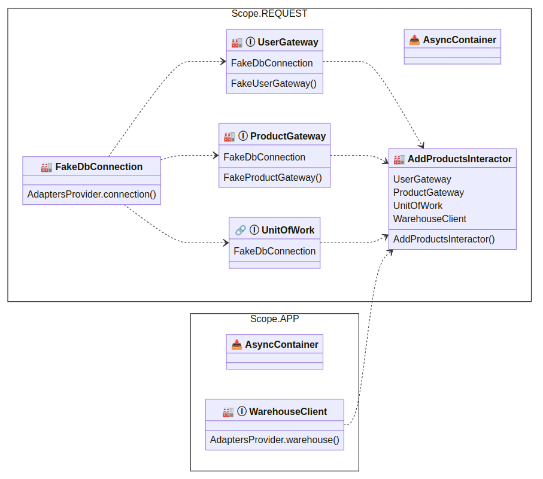

Dependency graph plotter
==============================

You can visualise your dependency graph by calling one of these functions

* ``dishka.plotter.render_d2(container)`` will produce a string in d2 lang format. Follow `<https://d2lang.com>`_ for more details how to show it
* ``dishka.plotter.render_mermaid(container)`` will produce a string containing ready to show HTML text containing graph in mermaid js format. Follow `<https://mermaid.js.org>`_ for more details on its customization.

The example rendered with mermaid:

