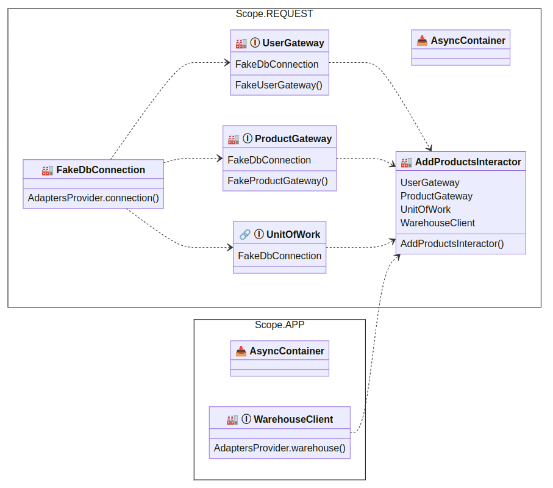

Визуализация графа зависимостей
==============================================

Вы можете визуализировать граф зависимостей, вызвав одну из этих функций:

* ``dishka.plotter.render_d2(container)`` — создаст строку в формате языка d2. Подробнее о том, как её отобразить, смотрите на `<https://d2lang.com>`_.
* ``dishka.plotter.render_mermaid(container)`` — создаст строку с готовым HTML-текстом, содержащим граф в формате mermaid js. Подробнее о его настройке читайте на `<https://mermaid.js.org>`_.

Пример визуализации с помощью mermaid:

